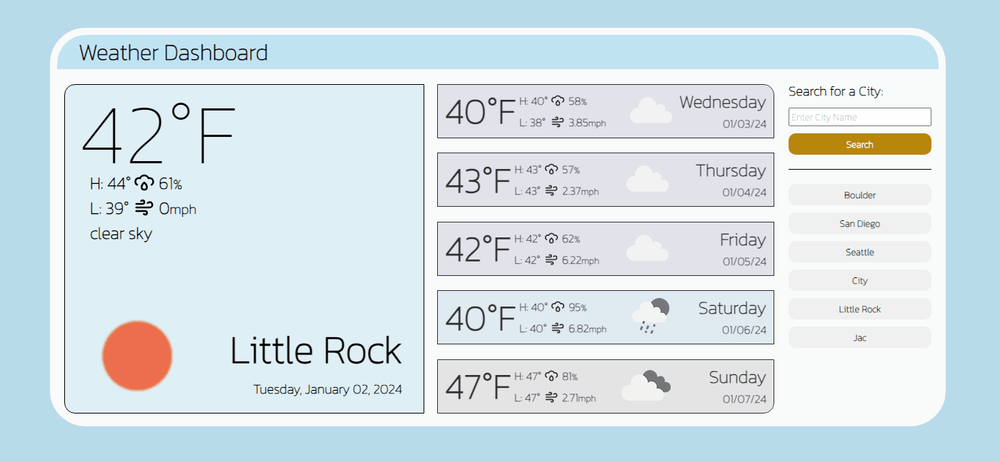

# weather_forecast_app

## Description

In this project, I created a weather dashboard web app. Its functionality includes an input box to search for a city. Upon searching, it displays the current weather and a 5-day forecast. The display shows the temperature, high and low temperatures, humidity, wind speed, and an icon corresponding to the weather conditions. Additionally, a description of the weather and the city name that was searched is displayed for the current day's weather. Users can navigate through their search history to view the weather conditions of previously selected cities.

Repository

## Repository
Link to deployed code: [Weather Dashboard](https://cjswayne.github.io/weather_forecast_app/)

## Mock Up

## Technologies

 - Search for a city name to display its weather data.
 - On startup, the app requests your location to automatically show the weather for that area.
 - Local storage within the browser saves city names entered through the search.

 - Based on the day's weather conditions, a color corresponding to that description is displayed, with each description having a unique color.

 - Utilizes [OpenWeather API](https://openweathermap.org/api)
 - DayJs, and Jquery
 - Built with DayJs, Jquery, Javascript, HTML and CSS

## Credits
- Resources provided by rutgers university full stack bootcamp
- Inspiration for this design comes from [Masood Ahmad](https://dribbble.com/shots/15524720-Weather-web-app) and his weather display design

## License 
This is under the MIT License
